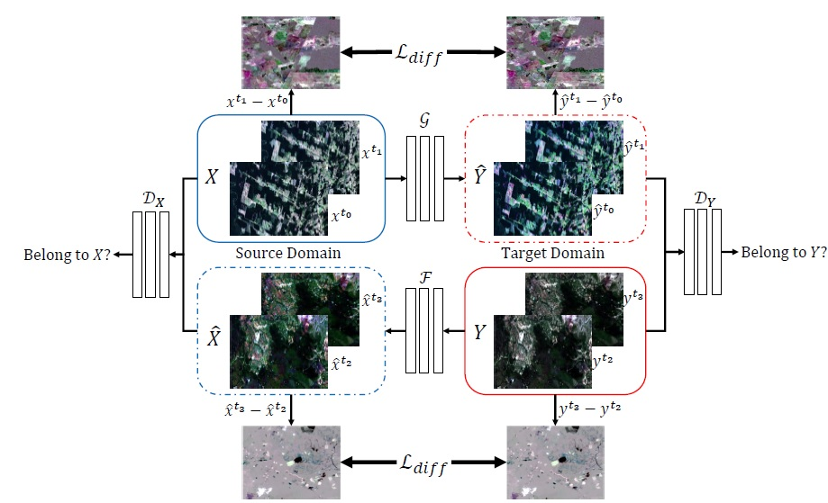
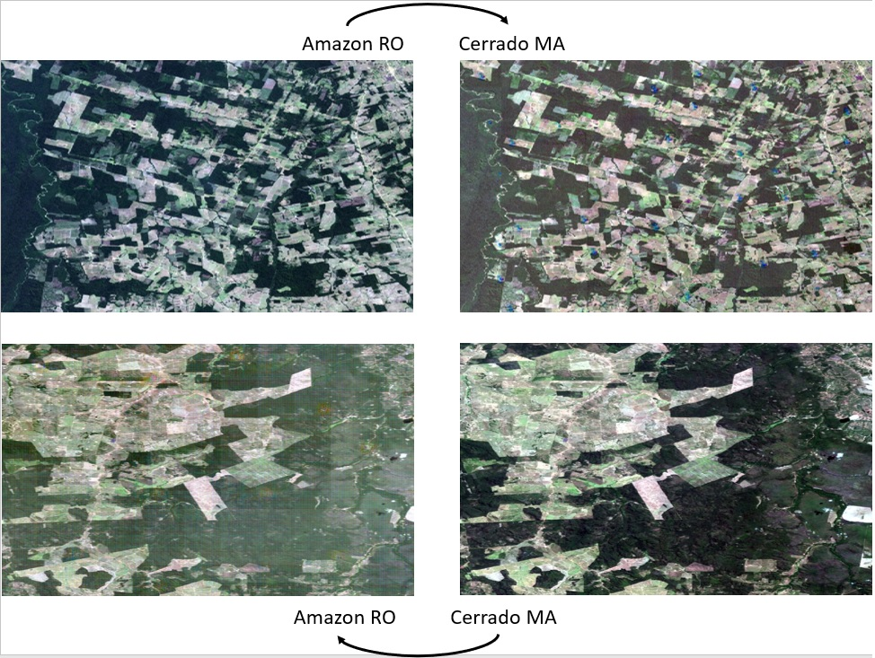

# CycleGAN-based Domain Adaptation for Deforestation Detection.

The current project contains the scripts to perform a Domain Adaptation based on CycleGAN technique for change detection in remote sensing data, specifically for deforestation detection in two Brazilian biomes, the Amazon rainforest(Brazilian Legal Amazon) and Brazilian savannah (Cerrado).

The following figure shows the overall architecture of the proposed methodology. As in the CycleGAN framework, the model contains two mapping functions G:X->Y and F:Y->X as well as the associated discriminators Dx and Dy. Dx encourages the generator F to translate Y into outcomes indistinguishable from X, and vice versa for Dy and Y. To further regularizes the translation procedure, we introduced two difference losses that aim at preserving the changes between the images of both domains in their respective translated versions. Although not represented, the model also uses the already known cycle consistency loss and the identity loss defined in [1].

# Prerequisites
1- Python 3.7.4

2- Pytorch 1.5

3- Tensorflow 2

4- [CycleGAN original code](https://github.com/junyanz/pytorch-CycleGAN-and-pix2pix) prerequisites. 

# The framework

This implementation is an adaptation of the [CycleGAN Pytorch](https://github.com/junyanz/pytorch-CycleGAN-and-pix2pix) for remote sensing data(Landsat 8 OLI). The main novelty in this release is the introduction of a new constraint into the model's cost function to alleviate the artifacts generation as well as the adaptation to work with remote sensing images of different dimensions.

# Train and Test
Execute, python Main_Script_Executor.py.

Main_Script_Executor.py calls the main train and test functions for remote sensing applications. Additionally, shows the principal hyperparameters for such kind of field. As in the CycleGAN framework, during the training, several intermediate models will be saved in the checkpoint folder as well as generated images for each generator. Once the training has been completed, the translated images will be generated automatically in the folder results. 

# Dataset
The images used in this project can be found in the following links for the [Amazon Biome](https://drive.google.com/drive/folders/1V4UdYors3m3eXaAHXgzPc99esjQOc3mq?usp=sharing) as well as for the [Cerrado](https://drive.google.com/drive/folders/14Jsw0LRcwifwBSPgFm1bZeDBQvewI8NC?usp=sharing). In the same way, the references can be obtained by clicking in [Amazon references](https://drive.google.com/drive/folders/15i04inGjme56t05gk98lXErSRgRnU30x?usp=sharing) and [Cerrado references](https://drive.google.com/drive/folders/1n9QZA_0V0Xh8SrW2rsFMvpjonLNQPJ96?usp=sharing).

# References

[1] J. Y. Zhu, T. Park, P. Isola, and A. A. Efros, “Unpaired Image-to-Image Translation Using Cycle-Consistent Adversarial Networks,” Proc. IEEE Int. Conf. Comput. Vis., vol. 2017-Octob, pp. 2242–2251, 2017, doi: 10.1109/ICCV.2017.244.
